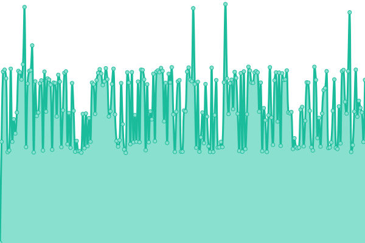
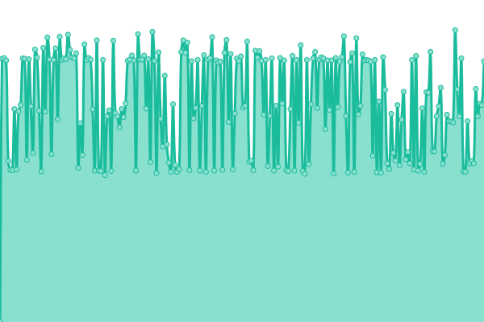

# [📈 Live Status](https://status.schnaq.com): <!--live status--> **🟧 Partial outage**

This repository contains the open-source uptime monitor and status page for [schnaq](https://schnaq.com), powered by [Upptime](https://github.com/upptime/upptime).

With [Upptime](https://upptime.js.org), you can get your own unlimited and free uptime monitor and status page, powered entirely by a GitHub repository. We use [Issues](https://github.com/schnaq/status/issues) as incident reports, [Actions](https://github.com/schnaq/status/actions) as uptime monitors, and [Pages](https://status.schnaq.com) for the status page.

<!--start: status pages-->
<!-- This summary is generated by Upptime (https://github.com/upptime/upptime) -->
<!-- Do not edit this manually, your changes will be overwritten -->
<!-- prettier-ignore -->
| URL | Status | History | Response Time | Uptime |
| --- | ------ | ------- | ------------- | ------ |
|  schnaq | 🟩 Up | [schnaq.yml](https://github.com/schnaq/status/commits/HEAD/history/schnaq.yml) | 

 550ms
     
 | 

<a href="https://status.schnaq.com/history/schnaq">100.00%</a>
    

|  schnaq API | 🟩 Up | [schnaq-api.yml](https://github.com/schnaq/status/commits/HEAD/history/schnaq-api.yml) | 

 587ms
     
 | 

<a href="https://status.schnaq.com/history/schnaq-api">65.08%</a>
    

|  Authentication (Keycloak) | 🟩 Up | [authentication-keycloak.yml](https://github.com/schnaq/status/commits/HEAD/history/authentication-keycloak.yml) | 

 511ms
     
 | 

<a href="https://status.schnaq.com/history/authentication-keycloak">100.00%</a>
    

|  Analytics (Matomo) | 🟩 Up | [analytics-matomo.yml](https://github.com/schnaq/status/commits/HEAD/history/analytics-matomo.yml) | 

 837ms
     
 | 

<a href="https://status.schnaq.com/history/analytics-matomo">100.00%</a>
    

|  S3 (MinIO) | 🟩 Up | [s3-min-io.yml](https://github.com/schnaq/status/commits/HEAD/history/s3-min-io.yml) | 

 478ms
     
 | 

<a href="https://status.schnaq.com/history/s3-min-io">100.00%</a>
    

|  Rancher | 🟩 Up | [rancher.yml](https://github.com/schnaq/status/commits/HEAD/history/rancher.yml) | 

 616ms
     
 | 

<a href="https://status.schnaq.com/history/rancher">100.00%</a>
    

|  schnaq Staging | 🟩 Up | [schnaq-staging.yml](https://github.com/schnaq/status/commits/HEAD/history/schnaq-staging.yml) | 

 576ms
     
 | 

<a href="https://status.schnaq.com/history/schnaq-staging">65.98%</a>
    

|  schnaq Staging API | 🟥 Down | [schnaq-staging-api.yml](https://github.com/schnaq/status/commits/HEAD/history/schnaq-staging-api.yml) | 

 728ms
     
 | 

<a href="https://status.schnaq.com/history/schnaq-staging-api">58.17%</a>
    

<!--end: status pages-->

[**Visit our status website →**](https://status.schnaq.com)

## 📄 License

- Powered by: [Upptime](https://github.com/upptime/upptime)
- Code: [MIT](./LICENSE) © [schnaq](https://schnaq.com)
- Data in the `./history` directory: [Open Database License](https://opendatacommons.org/licenses/odbl/1-0/)
